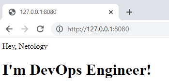

# Домашнее задание к занятию "5.3. Введение. Экосистема. Архитектура. Жизненный цикл Docker контейнера"

## Задача 1

### Вопрос

Сценарий выполения задачи:

- создайте свой репозиторий на https://hub.docker.com;
- выберете любой образ, который содержит веб-сервер Nginx;
- создайте свой fork образа;
- реализуйте функциональность:
запуск веб-сервера в фоне с индекс-страницей, содержащей HTML-код ниже:
```
<html>
<head>
Hey, Netology
</head>
<body>
<h1>I’m DevOps Engineer!</h1>
</body>
</html>
```
Опубликуйте созданный форк в своем репозитории и предоставьте ответ в виде ссылки на https://hub.docker.com/username_repo.

### Ответ

Ссылка https://hub.docker.com/repository/docker/rdbmw/nginx 



Была поднята ВМ через vagrant c пробросом порта 8080 хоста на порт 80 ВМ. 

## Задача 2

### Вопрос

Посмотрите на сценарий ниже и ответьте на вопрос:
"Подходит ли в этом сценарии использование Docker контейнеров или лучше подойдет виртуальная машина, физическая машина? Может быть возможны разные варианты?"

Детально опишите и обоснуйте свой выбор.

--

Сценарий:

- Высоконагруженное монолитное java веб-приложение;
- Nodejs веб-приложение;
- Мобильное приложение c версиями для Android и iOS;
- Шина данных на базе Apache Kafka;
- Elasticsearch кластер для реализации логирования продуктивного веб-приложения - три ноды elasticsearch, два logstash и две ноды kibana;
- Мониторинг-стек на базе Prometheus и Grafana;
- MongoDB, как основное хранилище данных для java-приложения;
- Gitlab сервер для реализации CI/CD процессов и приватный (закрытый) Docker Registry.


### Ответ

Т.к. с некоторыми инструментами не имел на практике дела - большую часть инфо пытался найти в поисковике.

1. Высоконагруженное монолитное java веб-приложение;

   Т.к. есть требование к производительности, то лучше использовать физическую машину.

 
3. Nodejs веб-приложение; 

   Nodejs приложения обычно имеют много зависимостей. Я бы использовал Docker для уверенности, что приложение запустится на любой ВМ.


3. Мобильное приложение c версиями для Android и iOS;

   Использования Docker кажется уместным, т.к. предполагают долгую разработку с множеством обновлений (если приложение успешно и развивается). Использование Docker для Android встречается, а вот для iOS не нашел инфо.   
   

5. Шина данных на базе Apache Kafka;
   
   На практике не сталкивался с такими инструментами. Гугл подсказывает, что использование Docker - нормальная практика.


7. Elasticsearch кластер для реализации логирования продуктивного веб-приложения - три ноды elasticsearch, два logstash и две ноды kibana;

   Гугл говорит, что Docker используют.


9. Мониторинг-стек на базе Prometheus и Grafana;
 
   Гугл говорит, что Docker используют.

 
10. MongoDB, как основное хранилище данных для java-приложения;
   
    На лекции говорили, что Docker для баз данных не лучшее решение, поэтому развернул бы на ВМ.

 
12. Gitlab сервер для реализации CI/CD процессов и приватный (закрытый) Docker Registry.

      Docker Registry в Docker кажется странным ). Использовал бы ВМ.


## Задача 3

### Вопрос 

- Запустите первый контейнер из образа ***centos*** c любым тэгом в фоновом режиме, подключив папку ```/data``` из текущей рабочей директории на хостовой машине в ```/data``` контейнера;
- Запустите второй контейнер из образа ***debian*** в фоновом режиме, подключив папку ```/data``` из текущей рабочей директории на хостовой машине в ```/data``` контейнера;
- Подключитесь к первому контейнеру с помощью ```docker exec``` и создайте текстовый файл любого содержания в ```/data```;
- Добавьте еще один файл в папку ```/data``` на хостовой машине;
- Подключитесь во второй контейнер и отобразите листинг и содержание файлов в ```/data``` контейнера.

### Ответ

Создаем папку на хостовой машине и запускаем centos с подключенной папкой 

```bash
vagrant@vagrant:~$ mkdir data
vagrant@vagrant:~$ cd data
vagrant@vagrant:~/data$ echo "hello, centos!" > file 
vagrant@vagrant:~/data$ ls -al                                                                                                                                                                                          
total 12                                                                                                                                                                                                                
drwxrwxr-x 2 vagrant vagrant 4096 Apr 20 20:03 .                                                                                                                                                                        
drwxr-xr-x 6 vagrant vagrant 4096 Apr 20 20:03 ..                                                                                                                                                                       
-rw-rw-r-- 1 vagrant vagrant   17 Apr 20 20:03 file                                                                                                                                                                     
vagrant@vagrant:~/data$ sudo docker run -dit -v ~/data:/data --name centos centos
7487f0df575d6824d35c07ccf07ec6541ae0592d73062e4f628213fbe4ac2121
vagrant@vagrant:~/data$ sudo docker ps
CONTAINER ID   IMAGE     COMMAND       CREATED          STATUS          PORTS     NAMES
7487f0df575d   centos    "/bin/bash"   13 seconds ago   Up 12 seconds             centos
```

Запускаем debian с подключенной папкой 

```bash
vagrant@vagrant:~/data$ sudo docker run -dit -v ~/data:/data --name debian debian
785dfe6d87ddfa0463e48cc917dd0d27c85f4cd7ea13afde59ad5635b5851460
vagrant@vagrant:~/data$ sudo docker ps
CONTAINER ID   IMAGE     COMMAND       CREATED              STATUS              PORTS     NAMES
785dfe6d87dd   debian    "bash"        2 seconds ago        Up 1 second                   debian
7487f0df575d   centos    "/bin/bash"   About a minute ago   Up About a minute             centos
```

Подключаемся к контейнеру centos

```bash
vagrant@vagrant:~/data$ sudo docker exec -it centos /bin/bash
[root@7487f0df575d /]# cd data/
[root@7487f0df575d data]# ls -al
total 12
drwxrwxr-x 2 1000 1000 4096 Apr 20 20:03 .
drwxr-xr-x 1 root root 4096 Apr 20 20:40 ..
-rw-rw-r-- 1 1000 1000   17 Apr 20 20:03 file
[root@7487f0df575d data]# echo "hello form centos!" > file_form_centos
[root@7487f0df575d data]# ls -al
total 16
drwxrwxr-x 2 1000 1000 4096 Apr 20 20:44 .
drwxr-xr-x 1 root root 4096 Apr 20 20:40 ..
-rw-rw-r-- 1 1000 1000   17 Apr 20 20:03 file
-rw-r--r-- 1 root root   19 Apr 20 20:44 file_form_centos
[root@7487f0df575d data]# exit
exit
vagrant@vagrant:~/data$ ls -al
total 16
drwxrwxr-x 2 vagrant vagrant 4096 Apr 20 20:44 .
drwxr-xr-x 6 vagrant vagrant 4096 Apr 20 20:03 ..
-rw-rw-r-- 1 vagrant vagrant   17 Apr 20 20:03 file
-rw-r--r-- 1 root    root      19 Apr 20 20:44 file_form_centos
```

Создаем файл на хосте

```bash
vagrant@vagrant:~/data$ echo "hello form host!" > file_from_host
vagrant@vagrant:~/data$ ls -al
total 20
drwxrwxr-x 2 vagrant vagrant 4096 Apr 20 20:49 .
drwxr-xr-x 6 vagrant vagrant 4096 Apr 20 20:03 ..
-rw-rw-r-- 1 vagrant vagrant   17 Apr 20 20:03 file
-rw-r--r-- 1 root    root      19 Apr 20 20:44 file_form_centos
-rw-rw-r-- 1 vagrant vagrant   17 Apr 20 20:49 file_from_host
```

Подключаемся к контейнеру debian и смотрим папку

```bash
vagrant@vagrant:~/data$ sudo docker exec -it debian /bin/bash
root@785dfe6d87dd:/# cd /data/
root@785dfe6d87dd:/data# ls -al
total 20
drwxrwxr-x 2 1000 1000 4096 Apr 20 20:49 .
drwxr-xr-x 1 root root 4096 Apr 20 20:41 ..
-rw-rw-r-- 1 1000 1000   17 Apr 20 20:03 file
-rw-r--r-- 1 root root   19 Apr 20 20:44 file_form_centos
-rw-rw-r-- 1 1000 1000   17 Apr 20 20:49 file_from_host
```


## Задача 4 (*)

### Вопрос 
Воспроизвести практическую часть лекции самостоятельно.

Соберите Docker образ с Ansible, загрузите на Docker Hub и пришлите ссылку вместе с остальными ответами к задачам.

### Ответ

Ссылка: https://hub.docker.com/repository/docker/rdbmw/ansible

При билде была ошибка

```bash
          ****************************************************************************

          Cannot install ansible-core with a pre-existing ansible==2.9.24
          installation.

          Installing ansible-core with ansible-2.9 or older, or ansible-base-2.10
          currently installed with pip is known to cause problems. Please uninstall
          ansible and install the new version:

              pip uninstall ansible
              pip install ansible-core

          If you want to skip the conflict checks and manually resolve any issues
          afterwards, set the ANSIBLE_SKIP_CONFLICT_CHECK environment variable:

              ANSIBLE_SKIP_CONFLICT_CHECK=1 pip install ansible-core

          ****************************************************************************
```
Добавил указанные строчки в Dockerfile и сборка завершилась успехом.


---

### Как cдавать задание

Выполненное домашнее задание пришлите ссылкой на .md-файл в вашем репозитории.

---
