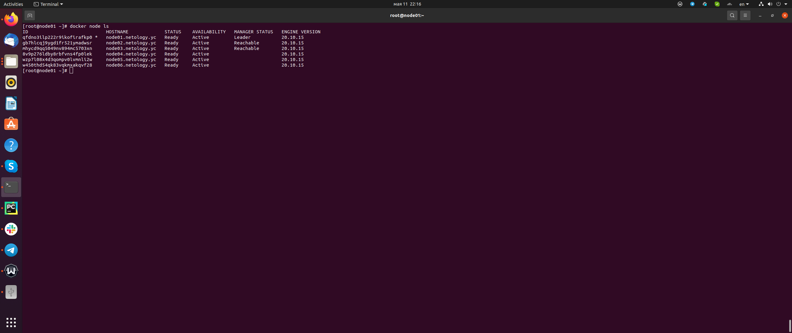
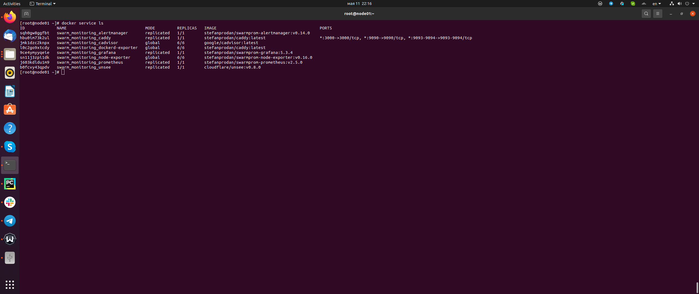

# Домашнее задание к занятию "5.5. Оркестрация кластером Docker контейнеров на примере Docker Swarm"

## Задача 1

### Вопрос

Дайте письменые ответы на следующие вопросы:

1. В чём отличие режимов работы сервисов в Docker Swarm кластере: replication и global?
2. Какой алгоритм выбора лидера используется в Docker Swarm кластере?
3. Что такое Overlay Network?

### Ответ

1. Режим replication позволяет указать количество экземпляров сервиса для развертывания на нодах кластера. 
В режиме global сервис разворачивается на каждой ноде кластера.   
2. При создании кластера мы указываем тип ноды - manager/worker. По умолчанию, первая нода в кластере
будет лидером. Далее, если лидер будет недоступен, Docker Swarm передаст лидерство другой ноде с типом manager.
При выборе нового лидера используется алгоритм поддержания распределенного консенсуса (Raft). 
3. Overlay Network - это сеть поверх другой сети. Контейнеры на разных нодах кластера используют подсети из
overlay-сети и могут обмениваться данными друг с другом.

## Задача 2

### Вопрос

Создать ваш первый Docker Swarm кластер в Яндекс.Облаке

Для получения зачета, вам необходимо предоставить скриншот из терминала (консоли), с выводом команды:
```
docker node ls
```

### Ответ



## Задача 3

### Вопрос

Создать ваш первый, готовый к боевой эксплуатации кластер мониторинга, состоящий из стека микросервисов.

Для получения зачета, вам необходимо предоставить скриншот из терминала (консоли), с выводом команды:
```
docker service ls
```
### Ответ



## Задача 4 (*)

Выполнить на лидере Docker Swarm кластера команду (указанную ниже) и дать письменное описание её функционала, что она делает и зачем она нужна:
```
# см.документацию: https://docs.docker.com/engine/swarm/swarm_manager_locking/
docker swarm update --autolock=true
```

